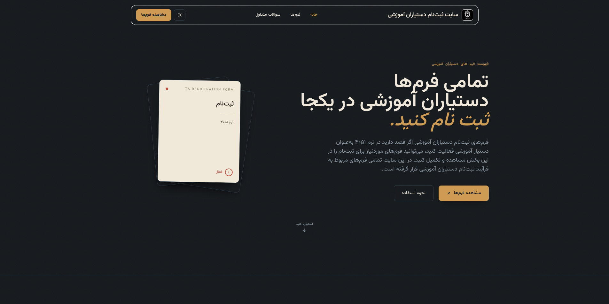

<div align="center">



# 🎓 TA Registration

### Teaching Assistant Registration Platform — Bu-Ali Sina University

<p>
  A simple, modern, and organized platform for registering in Teaching Assistant teams for different courses.
</p>

<p>
  📚 Courses • 👨‍🏫 Professors • 👨‍🎓 Students • 🤝 Collaboration
</p>

</div>

---

## ✨ About

**TA Registration** is a web-based platform designed to make the process of joining **Teaching Assistant (TA) teams** easier and more organized for students.

The idea is simple:

> 🎯 Find your course, check the professor and course information, and easily apply to join the Teaching Assistant team.

The project focuses on providing a clean, intuitive, and user-friendly experience throughout the registration process.

---

## 🚀 Features

- 📚 Browse available courses
- 👨‍🏫 Display the professor associated with each course
- 📝 Quick access to registration forms
- 🌐 Integration with Google Forms
- 📱 Fully responsive design
- 💻 Mobile, tablet, and desktop support
- ✨ Smooth animations and transitions
- 🧭 Simple and intuitive navigation
- 🎨 Modern and minimal UI
- ⚡ Lightweight and fast structure

---

## 🧑‍🏫 Teaching Assistant Registration

Students can apply to join the Teaching Assistant team for different courses.

You can register for **more than one course**, but the final approval for each course depends on the **professor's confirmation**. 👨‍🏫✅

---

## 📝 Registration Process

The registration process is simple:

```text
👨‍🎓 Enter the website
        │
        ▼
📚 Choose a course
        │
        ▼
👨‍🏫 Check professor information
        │
        ▼
📝 Open the registration form
        │
        ▼
🌐 Continue to Google Forms
        │
        ▼
✍️ Fill out the form
        │
        ▼
✅ Submit your application